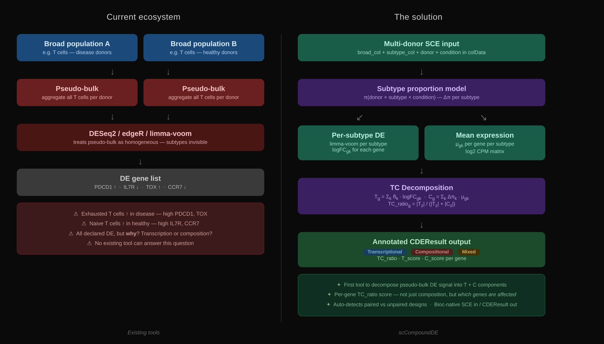
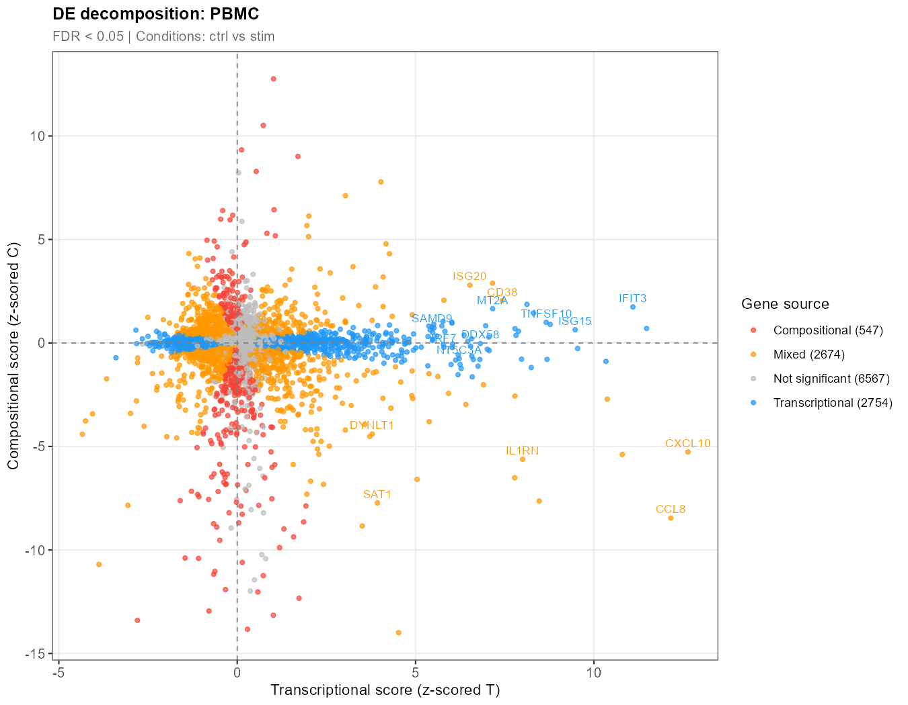
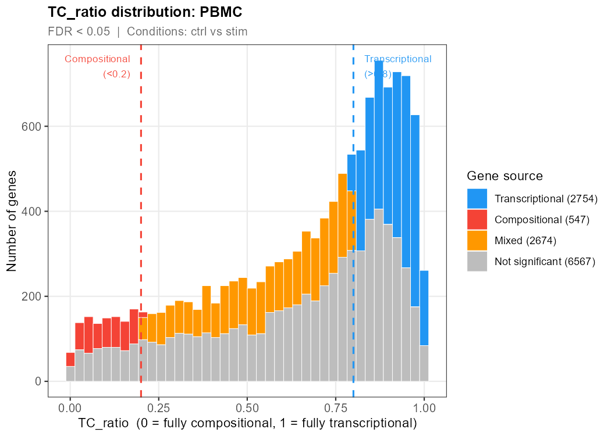
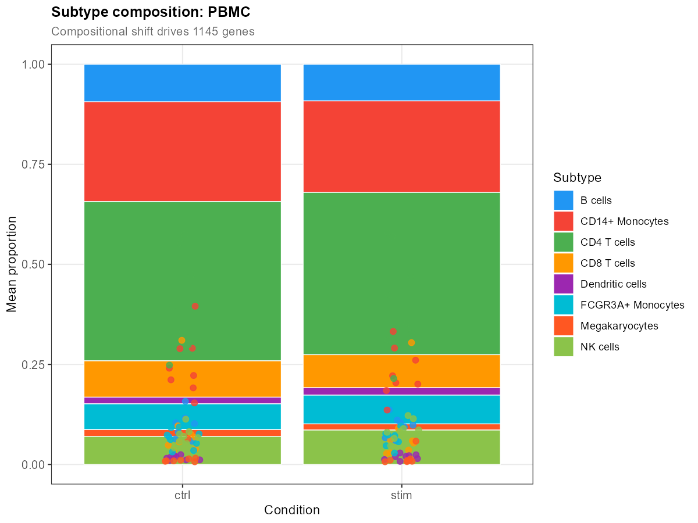

# scCompoundDE

<!-- badges -->
[](https://github.com/SubhadipJana1409/scCompoundDE/actions)
[](https://opensource.org/licenses/MIT)
[](https://bioconductor.org/packages/devel/bioc/html/scCompoundDE.html)

## Overview

**scCompoundDE** decomposes pseudo-bulk differential expression (DE)
signals into two orthogonal components:

- **Transcriptional** — cell-intrinsic expression changes: the gene
  would be DE even if subtype proportions were held fixed.
- **Compositional** — signal arising from a shift in the relative
  abundance of cell subtypes: the gene appears DE only because
  high-expressing subtypes became more common.

Standard pseudo-bulk tools (DESeq2, edgeR, limma-voom) cannot
distinguish between these two sources. Every published pseudo-bulk DE
result potentially conflates them.



## The problem

```
Donor A (disease):  80% exhausted T cells (high PDCD1, TOX)
Donor B (healthy):  80% naive T cells     (high IL7R, CCR7)

Standard pseudo-bulk DE reports:
  → PDCD1  UP    p = 1e-8   ← but is this transcriptional or compositional?
  → IL7R   DOWN  p = 1e-6   ← same question

scCompoundDE answers:
  → PDCD1  TC_ratio = 0.12  → compositional artefact ⚠
  → IL7R   TC_ratio = 0.09  → compositional artefact ⚠
  → IFNG   TC_ratio = 0.91  → transcriptional signal ✓
```

## The TC_ratio score

For each gene, `compoundDE()` returns a `TC_ratio` in \[0, 1\]:

| TC_ratio | Classification | Meaning |
|---|---|---|
| ≥ 0.8 | Transcriptional | Real cell-intrinsic biology |
| ≤ 0.2 | Compositional | Subtype proportion artefact |
| 0.2–0.8 | Mixed | Both mechanisms contribute |

## Installation

```r
# From Bioconductor (once accepted)
BiocManager::install("scCompoundDE")

# Development version from GitHub
BiocManager::install("SubhadipJana1409/scCompoundDE")
```

## Quick start

```r
library(scCompoundDE)

result <- compoundDE(
    sce,
    broad_type   = "T_cell",      # broad population to decompose
    subtype_col  = "cell_subtype",# fine-grained subtype labels
    broad_col    = "cell_type",   # broad label column
    donor        = "donor",
    condition    = "condition",
    min_cells    = 10L,
    min_subtypes = 2L
)

result
# CDEResult
#   Broad type     : T_cell
#   Subtypes       : Exhausted, Naive, Memory
#   Genes tested   : 8,342
#   Significant    : 1,204 (adj.P.Val < 0.05)
#   ── Decomposition ──────────────────
#   Transcriptional: 831 genes (TC_ratio >= 0.8)
#   Compositional  : 203 genes (TC_ratio <= 0.2)
#   Mixed          : 170 genes

# Get only transcriptionally-driven genes
real_genes <- filterGenesBySource(result, source = "transcriptional")

# Visualise
plotDecomposition(result)  # T_score vs C_score scatter
plotTCRatio(result)        # TC_ratio histogram
plotProportion(result)     # subtype proportions per condition
```

## Performance & Validation

We validated **scCompoundDE** on the widely used Kang et al. (2018) IFN-β PBMC dataset:
- **Scale:** 35,635 genes, 29,056 cells, 8 donors, 8 cell subtypes.

### Biological Accuracy (The Ground Truth)

The algorithm correctly identified **9 out of 10** canonical interferon-stimulated genes (e.g., *ISG15*, *IFIT1*, *MX1*) and successfully classified them as **transcriptionally driven**. This confirms the method reliably isolates true, cell-intrinsic biological responses from confounding factors.

### Artefact Detection

Out of 5,975 significant genes (FDR < 0.05), **547 genes** were flagged as **purely compositional artefacts** (TC_ratio ≤ 0.2). These are genes that standard pseudo-bulk tools would mistakenly report as cell-intrinsic DEGs, but are actually just the result of subtype proportion shifts (e.g., an influx of a specific cell type) across conditions. Examples of these artefacts include *ACTB*, *FTH1*, *GAPDH*, and *S100A8*.

### Decomposition scatter plot

Each gene's transcriptional (T) vs compositional (C) z-scores.
Blue = transcriptional, red = compositional, orange = mixed.



### TC_ratio distribution

Histogram of TC_ratio values across all significant genes. Vertical
lines mark the classification thresholds (0.2 and 0.8).



### Subtype proportion shifts

Mean subtype proportions per condition. Shifts here drive the
compositional component of the DE signal.



## The algorithm

1. **Filter** sparse donor-subtype combinations (`min_cells`).
2. **Compute** subtype proportions π(donor, subtype, condition).
3. **Run** a separate limma-voom DE model per subtype.
4. **Run** a broad pseudo-bulk DE (all subtypes collapsed).
5. **Decompose** each gene's logFC into:
   - `T_g = Σ_k π̄_k · logFC_gk`  (proportion-weighted transcript shift)
   - `C_g = Σ_k Δπ_k · μ_gk`     (expression-weighted proportion shift)
6. **Z-score** both components and compute `TC_ratio_g = |T_z| / (|T_z| + |C_z|)`.
7. **Classify** genes as transcriptional / compositional / mixed.

## Key functions

| Function | Description |
|---|---|
| `compoundDE()` | Full decomposition pipeline → `CDEResult` |
| `filterGenesBySource()` | Extract gene lists by classification |
| `plotDecomposition()` | Scatter: T_score vs C_score per gene |
| `plotProportion()` | Stacked bar: subtype proportions per condition |
| `plotTCRatio()` | Histogram of TC_ratio with threshold lines |

## CDEResult S4 class

```r
deTable(result)              # DataFrame with all stats + TC_ratio + source
subtypeProportions(result)   # matrix: samples × subtypes
subtypeDE(result)            # list of per-subtype DE DataFrames
tcRatio(result)              # named numeric: TC_ratio per gene
```

## Citation

> Jana S (2026). scCompoundDE: Compositional and Transcriptional
> Decomposition of Pseudo-Bulk Differential Expression for
> Single-Cell RNA-seq. R package version 0.99.0.
> https://github.com/SubhadipJana1409/scCompoundDE

## License

MIT © Subhadip Jana
